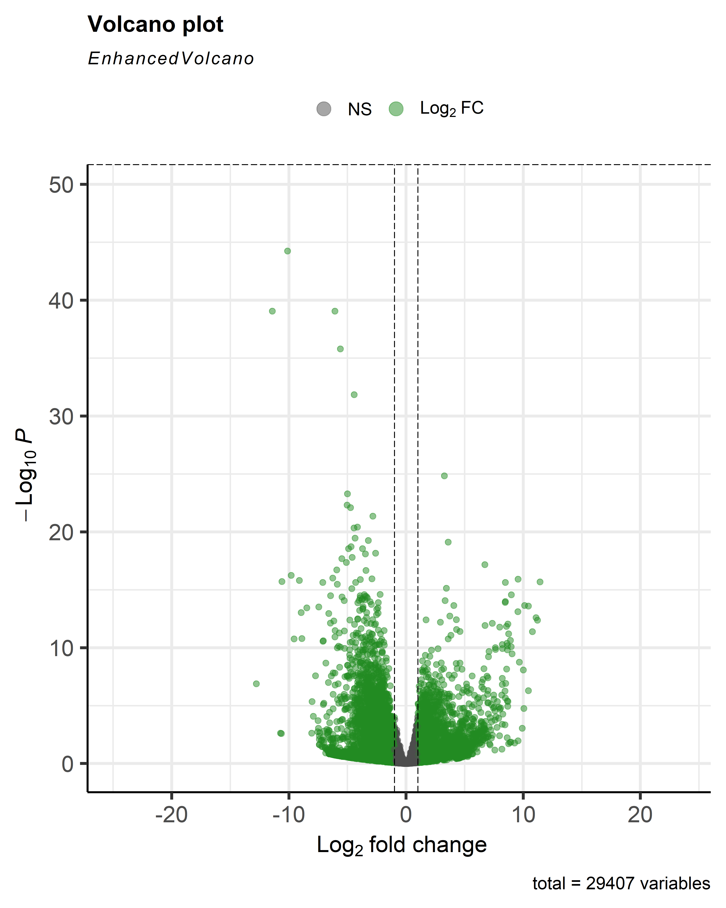

# Transcriptomics Jaar 2
Famke Brouwer

LBM3 J3P4 Transcriptomics

# Met behulp van transcriptomics kan worden aangetoond dat de genexpressie bij patiënten met reumatoïde artritis verandert

## Inhoud

- `Introductie` - inleiding en achtergrond van het onderzoek
- `Methode` - Beschrijving van de toegepaste analysemethoden
- `Scripts` - Scripts met aanvullende toelichting op de uitgevoerde analyses en methoden
- `Resultaten` - Weergave van de resultaten, waaronder de volcano plot, GO-analyse en KEGG-analyse 
- `Bronnen` - Overzicht van de gebruikte bronnen
- `README.md` - Bestand waarmee de tekst hier is gegenereerd

---

## Introductie 
Rheumatoïde artritis (RA) is een chronische auto-immuunziekte waarbij het immuunsysteem de gewrichten aanvalt. Dit leidt tot langdurige ontstekingen, vooral in de gewrichten van handen en voeten, wat uiteindelijk kan resulteren in pijn, beschadiging van weefsel en verminderde mobiliteit. De precieze oorzaak van deze auto-immuunziekte is nog onbebekend, maar men neemt wel aan dat het waarschijnlijk een genetische oorzaak heeft (Kurkó et al., 2013).

Transcriptomics maakt het mogelijk om op grote schaal veranderingen in RNA-expressie te onderzoeken en biedt daarmee inzicht in de activiteit van genen binnen cellen, van zowel RA-patënten en gezonde personen (Sumitomo et al., 2018). In deze studie wordt de genexpressie van RA-patiënten vergeleken met die van gezonde controles. Hierbij wordt onderzocht welke genen verschillend tot expressie komen en welke biologische processen en signaalroutes mogelijk betrokken zijn bij de ziekte (Hall et al., 2024).

## Methoden
Voor deze transcriptomics-analyse werd RNA-sequencingdata gebruikt van acht individuen: vier patiënten met reumatoïde artritis (RA) en vier gezonde controles. De [ruwe sequencingbestanden](Ruwe%20data/) (FASTQ-bestanden) werden eerst uitgepakt en vervolgens ingelezen in R. Daarna werd het [humane referentiegenoom](Referentie%20genoom) geïndexeerd met behulp van het pakket Rsubread. De reads van alle samples werden vervolgens uitgelijnd met de functie *align()*. De hieruit verkregen [BAM-bestanden](BAM%20files) vormden de basis voor de verdere analyses.

Met *featureCounts* werd een countmatrix gegenereerd. Hierbij werd gebruikgemaakt van een aangepaste GTF-annotatie, zodat uitsluitend reads die aan exons waren toegewezen werden meegeteld. De resulterende [volledige count-matrix](Count%20matrix) werd gebruikt voor de daaropvolgende analyses.

Om verschillen in genexpressie tussen de RA-groep en de controlegroep te identificeren, werd het pakket DESeq2 toegepast. De resultaten van deze differentiële expressieanalyse werden opgeslagen in een CSV-bestand en weergegeven met behulp van EnhancedVolcano.

Vervolgens werd met het R-pakket *goseq* onderzocht welke biologische processen oververtegenwoordigd waren onder de differentieel tot expressie gebrachte genen. Deze processen (GO-termen) kunnen inzicht geven in de biologische mechanismen die betrokken zijn bij RA en werden gevisualiseerd met behulp van ggplot2. Aansluitend werd een KEGG-analyse uitgevoerd om de betrokken biochemische pathways verder te onderzoeken. De resultaten hiervan werden gevisualiseerd met behulp van pathview.

Het volledige onderzoek werd uitgevoerd volgens de principes van data stewardship, waarbij aandacht is besteed aan een overzichtelijke mappenstructuur, transparantie van de analyses en reproduceerbaarheid van de resultaten.

**[Klik hier voor het volledige script](Script%20R%20casus%20rheumato%C3%AFde%20artitis.R)**
  

## Resultaten

### Volcanoplot van de genexpressie
Figuur 1 toont een volcanoplot waarin de expressiegegevens van in totaal 29.407 genen zijn weergegeven. Een groot aantal genen ligt rond een log2-fold change van 0, wat aangeeft dat deze genen geen statistisch significante verandering in expressie laten zien tussen beide onderzoeksgroepen. De groene stippen geven de genen weer die significant wel verschillen van expressie. 

Figuur 1: Volcanoplot toont de log2-fold change (x-as) tegen de -log10 p-waarde (y-as) voor alle gemeten genen (totaal: 29.407)

**[Afbeelding vergroten 🔍](Resultaten/Volcanoplot.png)**

### GO-analyse
Figuur 2 toont aan dat de genexpressie van genen die betrokken zijn bij de immuunrespons en andere biologische processen significant is veranderd. 

Figuur 2: Barplot Go-analyse, toont aan bij welke processen meeste verandering in gen expressie is waargenomen. 

**[Afbeelding vergroten 🔍](Resultaten/Go-anlyse.pdf)**

### Pathway-analyse 
In figuur 3 zijn verschillende genen te zien die significant verschillend tot expressie komen tussen RA-patiënten en gezonde controles. Zo vertonen de genen IL6, IL1β en MMP13 een verhoogde expressie. Deze genen spelen een belangrijke rol bij ontstekingsreacties, kraakbeenafbraak en gewrichtsschade. Daarentegen laten genen zoals TGFβ, dat betrokken is bij immuunregulatie en weefselherstel, en IL23, dat een rol speelt bij de activatie van ontstekingsbevorderende T-cellen, een verlaagde expressie zien.

Figuur 3: KEGG Pathview-afbeelding die de verschillen in genexpressie laat zien. Rood geeft verhoogde expressie weer, terwijl groen verlaagde expressie aangeeft.

**[Afbeelding vergroten 🔍](Resultaten/hsa05323%20pathview%20results.png)**

## Conclusie 
De resultaten laten zien dat de genexpressie bij patiënten met RA verschilt van die bij gezonde controles. Dit werd zichtbaar in de volcanoplot, waarin een groot aantal genen significant verschillend tot expressie kwam. De GO-analyse toonde vervolgens aan dat veel van deze genen betrokken zijn bij processen die samenhangen met de immuunrespons.

Deze bevindingen werden verder ondersteund door de KEGG-analyse, waarin genen zoals *IL6*, *IL1β* en *MMP13* verhoogd tot expressie kwamen. Deze genen spelen een belangrijke rol bij ontstekingsreacties, kraakbeenafbraak en gewrichtsschade. Daarentegen vertoonden *TGFβ*, dat betrokken is bij immuunregulatie en weefselherstel, en *IL23*, dat een rol speelt bij de activatie van ontstekingsbevorderende T-cellen, een verlaagde expressie. Samen wijzen deze resultaten op een verstoring van de regulatie van ontstekingsprocessen bij RA.

Dit onderzoek laat zien dat transcriptomics een waardevolle methode is om de moleculaire mechanismen achter RA beter te begrijpen. Aanvullend onderzoek met grotere patiëntengroepen en verschillende stadia van de ziekte wordt aanbevolen om de resultaten verder te bevestigen en mogelijk nieuwe biomarkers voor diagnose of behandeling te identificeren.
